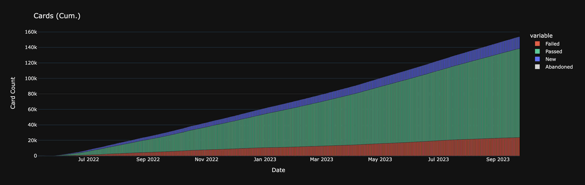

# `JPDBStats.jl`

<div align="center">
	
</div>

## Setup

I assume you have [Julia](https://julialang.org/)?

1. Clone the project using `git@github.com:daryll-ko/JPDBStats.jl.git`.

2. Download your `reviews.json` file from [jpdb's `Settings` page](https://jpdb.io/settings). If you don't use jpdb, you may use [mine](https://github.com/daryll-ko/jpdb-stats/blob/main/reviews.json) as a sample (it may not be up to date, however).

3. Activate the project in the Julia REPL (make sure you're in the `jpdb-stats` folder):

```bash
(v1.8) pkg> activate .
```

4. Install the relevant packages:

```bash
(JPDBStats) pkg> instantiate
```

5. Setup Revise.jl and import the package.

```bash
julia> using Revise

julia> using JPDBStats
```

## Usage

The first thing I would recommend doing is binding the package to a short variable:

```bash
julia> JS = JPDBStats
```

This makes it so that future references to the package can be made by just typing `JS` instead of `JPDBStats`.

The function `load_cards` turns the JP-to-EN vocab deck of the `reviews.json` file into a list of `Card`s:

```bash
julia> cards = JS.load_cards()
```

The function `get_all_reviews` extracts all individual review instances from the list of `Card`s:

```bash
julia> reviews = JS.get_all_reviews(cards)
```

Once you've extracted your cards and their reviews, there are several ways to look at the data you have at hand in a cleaner format.

The function `tabulate_card_data` returns a DataFrame containing basic information (word, reading, review count, last review date) for each card you have:

```bash
julia> df = JS.tabulate_card_data(cards)
```

Once you have your DataFrame, you can do all sorts of cool stuff with it!

For example, you can sort the cards by their review count:

```bash
julia> sort(df, :review_count)
```

Or you can filter cards matching a specific regular expression using the helper function `filter_words`:

```bash
julia> no = r"^不" #「不便」や「不吉」や「不正」など

julia> JS.filter_words(df, no)
```

```bash
julia> yojijukugo = r"^[一-龯]{4}$" #「一石二鳥」や「中途半端」や「十中八九」など

julia> JS.filter_words(df, yojijukugo)
```

```bash
julia> repeater = r"^([一-龯ぁ-んァ-ン]{2})\1$|^[一-龯]々$" #「いよいよ」や「そろそろ」や「度々」や「人々」など

julia> JS.filter_words(df, repeater)
```

## Notes

If you've already gone through the setup instructions once, some steps become unneeded; in future sessions (i.e., when starting up `julia`), only the following steps suffice:

1. Start with `pkg> activate .`
2. Activate Revise.jl with `julia> using Revise`
3. Activate JPDBStats.jl with `julia> using JPDBStats`

Relevant types:

```ts
type FivePointGrade = "nothing" | "something" | "hard" | "okay" | "easy";
type TwoPointGrade = "pass" | "fail";

interface Review {
	datetime: Date;
	grade: "unknown" | FivePointGrade | TwoPointGrade;
}

interface Card {
	spelling: string;
	reading: string;
	reviews: Review[];
}
```

JSON structure:

```bash
reviews.json
│
├── cards_vocabulary_jp_en: Card[]
│   ├── vid: Int
│   ├── spelling: String
│   ├── reading: String
│   └── reviews: Review[]
│       ├── timestamp: Int
│       ├── grade: "unknown" | FivePointGrade | TwoPointGrade
│       └── from_anki: Bool
│
├── cards_vocabulary_en_jp: Card[]
├── cards_kanji_keyword_char: Card[]
└── cards_kanji_char_keyword: Card[]
```

A `Card`'s `vid` and a `Review`'s `from_anki` status are not properties of the structs I define.

Since I only use JP to EN vocab cards, the decks `cards_vocabulary_en_jp`, `cards_kanji_keyword_char`, and `cards_kanji_char_keyword` are empty for me.

## Write-up

This was inspired by `bijak`'s [`jpdb_stats` repo](https://github.com/bijak/jpdb_stats). Because I have a copious amount of jpdb.io data, I thought this would be an excellent opportunity to work with Julia from a data-driven perspective.

I'd like to highlight _data-driven_ here. There have been a bunch of data-related projects that I've churned in my head, only to be shot down because I classified them as vanity metric obsessions. For example, I have a _lot_ of data on AniList, but I've made it a personal rule to not bother doing data analysis related to it: I don't think it's a fruitful use of my time.

In contrast, analyzing my stats in `jpdb` gives me relevant ground to work on. One use case that motivated this whole thing in the first place is _batching_: at what time of the day do I usually do my reviews, and are there any immediate changes I can make to my review habits to make my active study time minimal?

One fun thing to think about throughout this project was how to keep the interface as modular as possible. If I had a table of card data, how could I design things to make feature extraction seamless?

At any rate, looking at my own stats has shown me how integral `jpdb` has been to my growth as an immersion learner. My competence before and after incorporating it into my own life is staggering; I truly am happy I'm on the side where I want to be now.

Well, this is a journey that I expect to last an eternity, so you could say this is barely the first chapter into a grand adventure. I hope my future self has a great time!

Now to go back to my light novels...
