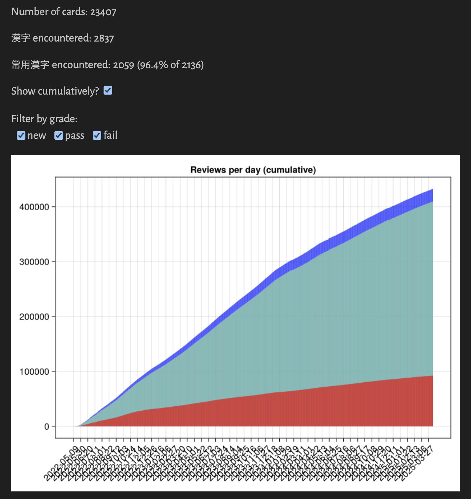

# `jpdb-stats`

<div align="center">
	
</div>

## Usage

You'll need [Julia](https://julialang.org/) and [Pluto](https://github.com/fonsp/Pluto.jl).

This _is_ a notebook, so what you want to see is dictated by the code that exists. There's an out-of-the-box review graph that can be viewed cumulatively and filtered by grade & a card table sorted by fail counts which can be filtered via regexes.

Here are some example regexes for convenience:

| Regex | Description | Examples |
---------------------------------
| `^不` | words that start with「不」| 不便、不吉、不正 |
| `^[一-龯]{4}$` | words that consist of exactly 4 漢字 (most likely 四字熟語) | 一石二鳥、中途半端、十中八九 |
| `^([一-龯ぁ-んァ-ン]{2})\1$|^[一-龯]々$` | words that repeat (most likely 擬音) | いよいよ、そろそろ、度々、人々 |

## Notes

Relevant types:

```ts
type FivePointGrade = "nothing" | "something" | "hard" | "okay" | "easy";
type TwoPointGrade = "pass" | "fail";

interface Review {
	datetime: Date;
	grade: "unknown" | FivePointGrade | TwoPointGrade;
}

interface Card {
	spelling: string;
	reading: string;
	reviews: Review[];
}
```

JSON structure:

```bash
reviews.json
│
├── cards_vocabulary_jp_en: Card[]
│   ├── vid: Int
│   ├── spelling: String
│   ├── reading: String
│   └── reviews: Review[]
│       ├── timestamp: Int
│       ├── grade: "unknown" | FivePointGrade | TwoPointGrade
│       └── from_anki: Bool
│
├── cards_vocabulary_en_jp: Card[]
├── cards_kanji_keyword_char: Card[]
└── cards_kanji_char_keyword: Card[]
```

A `Card`'s `vid` and a `Review`'s `from_anki` status aren't properties of structs defined in the notebook.

Since I only use JP to EN vocab cards, the decks `cards_vocabulary_en_jp`, `cards_kanji_keyword_char`, and `cards_kanji_char_keyword` are empty for me. You can change `parse_cards` to suit your needs.

## Write-up

### 12/29/23

It's been 10 months! So much has happened since then: celebrating my 1 year Refold anniversary, passing N1, hitting 20K non-redundant words, immersing in all sorts of things. I'm kind of surprised I've gone this far; consistency can truly result in wild things happening.

After almost 600 days of doing this, I'm finally lowering daily cards from 30 to 10; I think it's just about the right time to dive even deeper into other aspects of JP language and culture.

I'll see if I can do something about leeches; I've heard some anecdotes on the JPDB server about manual leech-picking being a godsend, and I'd like to explore that idea.

To me that wrote the previous write-up, things are still going strong. Thanks for pushing through, and here's to a 2024 filled with more fun! ^^

### 02/22/23

This was inspired by `bijak`'s [`jpdb_stats` repo](https://github.com/bijak/jpdb_stats). Because I have a copious amount of jpdb.io data, I thought this would be an excellent opportunity to work with Julia from a data-driven perspective.

I'd like to highlight _data-driven_ here. There have been a bunch of data-related projects that I've churned in my head, only to be shot down because I classified them as vanity metric obsessions. For example, I have a _lot_ of data on AniList, but I've made it a personal rule to not bother doing data analysis related to it: I don't think it's a fruitful use of my time.

In contrast, analyzing my stats in `jpdb` gives me relevant ground to work on. One use case that motivated this whole thing in the first place is _batching_: at what time of the day do I usually do my reviews, and are there any immediate changes I can make to my review habits to make my active study time minimal?

One fun thing to think about throughout this project was how to keep the interface as modular as possible. If I had a table of card data, how could I design things to make feature extraction seamless?

At any rate, looking at my own stats has shown me how integral `jpdb` has been to my growth as an immersion learner. My competence before and after incorporating it into my own life is staggering; I truly am happy I'm on the side where I want to be now.

Well, this is a journey that I expect to last an eternity, so you could say this is barely the first chapter into a grand adventure. I hope my future self has a great time!

Now to go back to my light novels...
